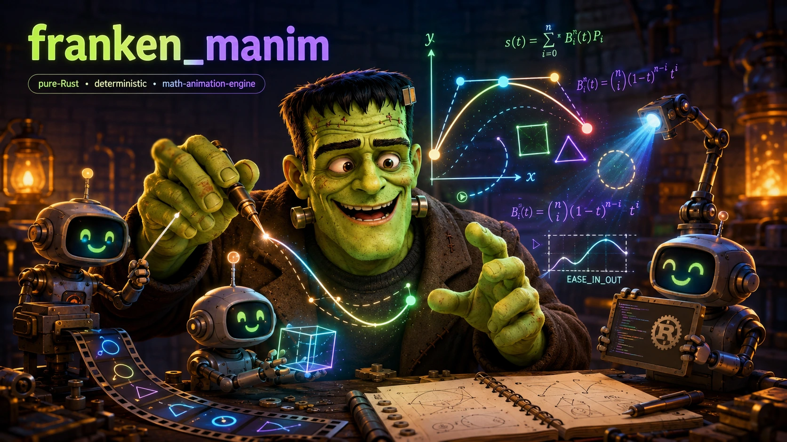

<p align="center">
  
</p>

# franken_manim

<div align="center">

[](./LICENSE)
[](https://doc.rust-lang.org/edition-guide/rust-2024/)
[](./COMPREHENSIVE_PLAN_FOR_THE_DESIGN_OF_FRANKEN_MANIM.md)
[](https://github.com/rust-secure-code/safety-dance/)
[](./COMPREHENSIVE_PLAN_FOR_THE_DESIGN_OF_FRANKEN_MANIM.md)
[](./COMPREHENSIVE_PLAN_FOR_THE_DESIGN_OF_FRANKEN_MANIM.md)

**A sovereign, deterministic rewrite of manim (Grant Sanderson's mathematical-animation engine behind 3Blue1Brown) in pure Rust on the FrankenSuite. API- and semantics-compatible with `manimlib`, it typesets TeX mathematics natively (no LaTeX, no Pango, no system fonts), rasterizes Bézier geometry analytically instead of replaying GPU workarounds, and produces bit-identical certified renders on any machine at any thread count. It installs as one binary that needs nothing but (optionally) ffmpeg.**

</div>

```bash
curl -fsSL https://raw.githubusercontent.com/Dicklesworthstone/franken_manim/main/scripts/install.sh | bash
```

> **A note on tense (read this first).** This README is written in the **present tense, as if the entire design in [`COMPREHENSIVE_PLAN_FOR_THE_DESIGN_OF_FRANKEN_MANIM.md`](./COMPREHENSIVE_PLAN_FOR_THE_DESIGN_OF_FRANKEN_MANIM.md) is fully realized**: the 1.0 target state where every performance gate is green and every subsystem is live. This is a deliberate choice. It lets the document describe the *finished* system so it gets **trued-up in place as milestones land** (§20's gates G0→G5) rather than rewritten from scratch later. Where the plan itself tiers something out as genuinely future work (complex-script shaping, CFF fonts, arbitrary GLSL, all covered under [Limitations](#limitations)), the README says so plainly. Everything else below is the spec of the system this repository builds.

---

## TL;DR

**The problem.** manim's *ideas* are superb and its *substrate* is an accident of history. The engine behind 3Blue1Brown is ~23,000 lines of Python riding roughly thirty third-party packages, an OpenGL driver stack, a C Pango build, **a full LaTeX distribution**, and CPython. The LaTeX dependency alone means no clean install, no WASM, no server deployment without a container full of native software, and no reproducibility: two machines rendering the same scene routinely produce different output. And under the beloved API, the mathematics is approximate: `get_arc_length` returns a chord-length heuristic, `MoveAlongPath` doesn't move at constant speed, three mutually inconsistent arc-density conventions coexist, the frame clock accumulates float drift, and strokes are ≤32-segment polyline ribbons pretending to be curves.

**The solution.** `franken_manim` keeps what made manim great (the class surface, the scene model, the animation semantics, the *look*) and rebuilds the substrate from scratch in Rust. The FrankenSuite already replaced the scientific stack (`franken_numpy`, `frankenscipy`, `franken_networkx`, `frankenpandas`, `frankentorch`, `asupersync`); the missing piece was mathematics on screen, so this program builds **fmd-math**: a clean-room TeX-math layout engine (KaTeX/Typst-class) that lands inside `franken_markdown` with Computer Modern bundled, giving every Franken document native `$…$` math and deleting LaTeX from the animation pipeline entirely. Under manim's familiar names, everything now does the correct thing: true arc length, one drift-free rational clock, one seeded RNG, defined color science, analytic curve rasterization. The Reference (`3b1b/manim`, commit-pinned) is the design oracle and the aesthetic bar, **not a pixel warden**.

**Why `franken_manim`:**

| | `franken_manim` |
|---|---|
| Installation | **One binary.** No LaTeX, no dvisvgm, no Pango, no fontconfig, no system fonts, no Python required. ffmpeg is the *single* external tool, and even it is optional (native y4m/PNG/GIF outputs). |
| Typesetting | Native TeX-math layout (**fmd-math**) on bundled Computer Modern, laid out by TeX's published rules; text shaping on bundled OFL faces. Substring→glyph **span maps come from layout provenance**; manim's render-twice-and-align hack is dead. |
| Correctness | True arc length, constant-speed paths, a drift-free rational clock on manim's exact sample points, one bit-exact PCG64DXSM RNG, linear-light compositing with manim's gradient aesthetic preserved. Every deliberate difference is a documented **Behavior Note**. |
| Rendering | Analytic nonzero-winding coverage on the actual quadratic curves, true curve-distance strokes with round caps and principled joins, replacing the Reference's signed-alpha blending tricks and polyline ribbons, with 3b1b's lighting, palette, and ~1.5 px AA *feel* deliberately kept. |
| Determinism | `--reproducible` renders are **bit-identical** (raw frames, canonical PNGs, WAV) across the certified platform matrix, from a content-hashed input closure, at any thread count. |
| Performance | Retained render IR with revisioned caches and glyph instancing, adaptive edge-AA, frame-parallel pure segments, pipelined stages, SIMD build tiers, topology-aware render teams; a 96-core workstation saturates on a single scene while certified bits stay pinned. |
| Compatibility | `fmn-python` presents the `manimlib` module surface with real subclassing semantics: existing manim scenes run **source-unedited**. |
| Safety | `#![forbid(unsafe_code)]` in every authoritative crate (the PyO3 binding crate is the sole, isolated exception); the full transitive dependency closure is pinned, allowlisted, and audited. |
| Extras manim never had | The Studio (crash-isolated live iteration, scrubbing, inspection), WASM tiers, a terminal (kitty/sixel) preview, batch render farms, graph/dataframe/neural-network mobjects from the suite. |

---

## Quick example

The same scene, through both front doors.

**Python (`manimlib`-compatible, source-unedited):**

```python
from manimlib import *

class SquareToCircle(Scene):
    def construct(self):
        square = Square(side_length=2.0, color=BLUE)
        label  = Tex(r"\int_0^\infty e^{-x^2}\,dx = \frac{\sqrt{\pi}}{2}")
        label.next_to(square, UP)

        self.play(ShowCreation(square), Write(label))
        self.play(square.animate.rotate(PI / 4).set_fill(BLUE, opacity=0.5))
        self.play(Transform(square, Circle(radius=1.0, color=YELLOW)))
        self.wait()
```

```bash
fmn scene.py SquareToCircle -o                # renders and opens; no LaTeX installed, anywhere
fmn scene.py SquareToCircle --reproducible    # certified: bit-identical frames on every machine
```

**Rust (the native API):**

```rust
use fmn::prelude::*;

struct SquareToCircle;

impl SceneConstruct for SquareToCircle {
    fn construct(&self, stage: &mut Stage) -> fmn::Result<()> {
        let square = stage.add(Square::new().side_length(2.0).color(BLUE));
        let label  = stage.add(Tex::new(r"\int_0^\infty e^{-x^2}\,dx = \frac{\sqrt{\pi}}{2}"));
        stage.get_mut(label).next_to(square, UP);

        stage.play((ShowCreation::new(square), Write::new(label)))?;
        stage.play(square.animate().rotate(PI / 4.0).set_fill(BLUE, 0.5))?;
        stage.play(Transform::new(square, Circle::new().radius(1.0).color(YELLOW)))?;
        stage.wait(1.0)
    }
}
```

The `Tex` mobject above is laid out by fmd-math from bundled Computer Modern (same paths, every platform, every time), and `MoveAlongPath`, dashes, tips, and tracers all place by *true* arc length.

---

## The design commitments

No single trick makes this a leapfrog. The composition does.

| Commitment | One-line statement |
|---|---|
| **API compatibility, semantic fidelity** | manim's classes, constructors, lifecycle, and conventions carry over exactly, and under those names the engine does the *correct* thing. Output identity with Python manim is an explicit non-goal. |
| **No MVP** | Every subsystem is specified at full strength; sequencing is by dependency, not scope reduction. Gate G0 retires the load-bearing unknowns as compile-tested spikes before any interface freezes. |
| **Sovereignty: one external tool** | ffmpeg, sandboxed and optional, for encode/mux/transcode, because owning a modern video encoder would be vanity. Everything else, *especially typesetting*, is native. |
| **Determinism as a product feature** | With LaTeX and Pango gone from every path, the pipeline up to the encode boundary is closed: same content-hashed input ⇒ bit-identical frames across the certified matrix. |
| **Two front doors, one engine** | A first-class Rust API and `fmn-python`, a PyO3 `manimlib` with normal Python subclassing semantics. |
| **One semantics, many engines** | Lumen is one renderer *semantically*: certified CPU, fast CPU, and the GPU Accelerator Annex share the render IR and the test corpus, never a lowest-common-denominator kernel. |
| **Pinned bits, free scheduler** | Wherever bits are promised, every schedule must reproduce them exactly; everywhere else the scheduler is free. Performance is architecture, not a late micro-optimization pass. |

---

## Design philosophy

The constitutional constraints the whole system is built under. They read like restrictions; they are the moat.

1. **The dependency closure is governed.** Authoritative crates introduce no new unreviewed runtime dependencies beyond `std`, the exact pinned nightly, and the Dicklesworthstone FrankenSuite: `franken_numpy`, `frankenscipy`, `franken_markdown` (which this program extends with `fmd-font` and `fmd-math`), `franken_networkx`, `frankenpandas`, `frankentorch`, `asupersync`. The complete transitive closure is pinned, per-package allowlisted, and audited for `unsafe` and native-code exposure; CI fails on any unlisted package.
2. **One external tool, ever.** ffmpeg is the only subprocess the engine will invoke, under a full security protocol (argv-only, private temp dirs, timeouts, output limits, content-hash into provenance), and its absence yields a *capability error naming the alternative*, never a silent substitution. No TeX, no font tooling, no downloader.
3. **Memory safety is structural.** `#![forbid(unsafe_code)]` in every authoritative crate; the only project-authored `unsafe` in the tree is PyO3's expansion inside the isolated binding crate. SIMD is `std::simd` with safe `#[target_feature]` build tiers; no `unsafe` dispatch trampoline exists anywhere.
4. **Correct by default, documented when different.** True arc length, one RNG, the rational clock, defined color, fixed Reference bugs: every divergence from Python manim is deliberate, correct, and written up as a migration-guide Behavior Note. There is no quirk-replication obligation anywhere in the program.
5. **The parallelism contract binds everything.** A frame's bits are a pure function of *(state snapshot, alpha, frame-indexed RNG, input closure)*, never of thread count, scheduling order, or machine load. Three refusals are permanent: GPU work in the certified path, adaptive frame sampling, and per-thread RNG consumed in completion order.
6. **Correctness and beauty outrank speed, always.** Self-goldens are bit-locked merge blockers; the Look Gallery judges every renderer change against captured Reference imagery; a faster path that drifts a result is reverted, not landed.

---

## How it works

`franken_manim` is ten named subsystems, from the two front doors down to the pixels:

```
            ┌──────────────────────── two front doors ────────────────────────┐
            │   Rust API (fmn)                     fmn-python (`import manimlib`)│
            └───────────────┬──────────────────────────────┬───────────────────┘
                            ▼                              ▼
   ┌──────────── PROSCENIUM: scene runtime, events, Studio, CLI ──────────────┐
   └───────┬───────────────────────────┬──────────────────────────┬───────────┘
           ▼                           ▼                          ▼
   CHOREO: animation engine    MARIONETTE: mobject engine    MENAGERIE+ATLAS:
   Animation trait · clock     RecordBuffer arena · family   the 161-class
   timeline algebra · align    tree · styles · updaters      mobject library
           │                           │                          │
           └───────────┬───────────────┴───────────┬──────────────┘
                       ▼                           ▼
              CHISEL: geometry kernel      SCRIBE: text & math typesetting
              true math, manim layout      fmd-font + fmd-math (native TeX)
                       │                           │
                       └────────────┬──────────────┘
                                    ▼
                     LUMEN: the renderer (analytic, beautiful, deterministic)
                                    ▼
                     REEL: output (native codecs · the one ffmpeg boundary)
   ────────────────────────────────────────────────────────────────────────────
   SUBSTRATE: fmn-core/dmath/hash/config/platform/frame/codec/cache
   GAUNTLET (fmn-conformance): ledger · self-goldens · Look Gallery · gates
```

- **Substrate:** mixed-precision numeric doctrine (semantic geometry in f64; the Reference's f32 record dtypes kept as API surface); one seeded RNG, PCG64DXSM with named substreams and *keyed per-frame forks*, the property that makes frame-parallel rendering replay-identical by construction; `fmn-dmath`, an owned deterministic elementary-function layer, because `std`'s transcendentals differ across platforms and this engine is transcendental-dense; canonical hashing and versioned serialization; capability traits for filesystem/clock/process/network plus `HardwareTopology` introspection.
- **Chisel (geometry):** the shared-anchor quadratic-Bézier path model implemented formally; **one** error-bounded cubic→quadratic converter serving every path (API, SVG, fonts, smoothing); a true arc-length layer with an inverse-arclength LUT so `point_from_proportion` and `MoveAlongPath` are constant-speed under the original names; planar path booleans with a certified flatten-and-clip fallback shipping first; a hardened SVG document processor; adaptive isolines; space_ops with scipy-`Rotation` conventions fixed as documented semantics.
- **Marionette (mobjects):** a `Stage` arena with generational handles and CoW snapshots; the `RecordBuffer`, interleaved f32 records with live zero-copy NumPy structured views under a specified view protocol, backed by lazy, revisioned struct-of-arrays render mirrors so the hot loops never read the compatibility layout; manim's copy semantics implemented to the letter; the full positional API locked by fixtures; the Reference's render-order model kept as semantics; insertion-ordered updaters (with the Reference's double-call bug fixed) and the `.animate` builder's real rules.
- **Choreo (animation):** the `Animation` lifecycle exactly; the **RationalFrameClock**, i64 frame arithmetic emitting manim's exact nominal sample points with zero drift; the six-step frame order preserved verbatim (scenes depend on it), with an immutable **FramePacket** frozen at capture so everything downstream can pipeline; 80 animation classes as parameterizations of five mechanisms; and **segment purity classification**: `play()` segments whose frames depend only on the begin-state snapshot and alpha are automatically rendered embarrassingly parallel across frames.
- **Lumen (rendering):** tiled scanline nonzero-winding coverage evaluated *analytically on the curves*, with no triangulation and no signed-alpha tricks; true curve-distance strokes with round caps, real joins, and arc-length width interpolation; the Reference's lighting model, projection constants, palette, glow falloff, and ~1.5 px AA feel ported deliberately as the calibrated look; adaptive coverage AA (interiors as vectorized spans, supersampling only at complex edges); a **retained** compiled render IR with per-resource revisions, primitive-hint fast paths, glyph/shape instancing, two-level binning, painter-order-safe occlusion pruning, and a retained compositor whose reused tiles are byte-identical, so tile reuse works even under `certified`.
- **Scribe (typesetting):** native text shaping and layout over `fmd-font`; **fmd-math** for TeX mathematics: the eight atom classes, the inter-atom spacing table, style propagation, Appendix-G placement parameters over hand-calibrated math metrics for the bundled faces, extensible delimiters with drawn-path construction as the universal fallback, `\newcommand`-tier macros and preamble packs. Every glyph carries source-span provenance natively, so `isolate`, `tex_to_color_map`, and `TransformMatchingTex` consume a span map instead of manim's render-twice-and-align hack. Unsupported constructs fail as precise, named errors feeding a **public coverage ratchet**.
- **Menagerie + Atlas (the library):** all 161 non-runtime classes (geometry lineages with one consistent arc-density rule, coordinate systems and plotting on native text, vector fields and StreamLines on a tuned adaptive RK45, 3D solids and surfaces with the kept lighting), plus the **de-TeX'd natives**: `Brace` as a parametric path generator, Matrix brackets from the extensible-delimiter engine, `DecimalNumber` as pure text, so the incidental classes no longer route through a typesetter at all.
- **Proscenium (runtime):** the scene state machine on the rational clock; events and `InteractiveScene`; live iteration without `dlopen`, via a supervisor with isolated scene-worker subprocesses, incremental rebuild, checkpoint restore, and journal replay with an effect model; the **Studio** (loopback-only, capability-token security, multipart-PNG stream, timeline scrubbing, family/record/span-map inspector, debug overlays, kitty/sixel TUI); the `fmn` CLI with manim's flag surface and `fmn doctor`.
- **Reel (output):** native PNG (full color-type matrix) / JPEG decode / GIF / y4m / WAV codecs; PNG sequences encoded in parallel with fixed DEFLATE block boundaries so bytes are deterministic on any thread count; an ordered asynchronous emitter over preallocated frame rings; and the **negotiated ffmpeg boundary**, where pixel format (RGBA/NV12/P010), orientation, transfer, and encoder are negotiated per job, hardware encoders (VideoToolbox/NVENC) are available as a standard-mode knob, and everything is fingerprinted into provenance.
- **Gauntlet (verification):** the symbol-granular Parity Ledger generated from one API schema shared by both front doors; correctness oracles against analytic ground truths and TeX's published rules; bit-locked self-goldens as the merge gate; the human-judged Look Gallery; an engine-equivalence suite holding fast-CPU and GPU engines to a versioned visual budget against certified frames; parser fuzzing with resource budgets; and eight CI-enforced performance gates.

The full census lives in [`COMPREHENSIVE_PLAN_FOR_THE_DESIGN_OF_FRANKEN_MANIM.md`](./COMPREHENSIVE_PLAN_FOR_THE_DESIGN_OF_FRANKEN_MANIM.md): the verified 257-class Reference census, the dependency displacement map, every subsystem contract, and the workstream/gate program.

## How it compares

Honest framing. `franken_manim` is the only entry that combines a one-binary install, native TeX typesetting, certified bit-reproducible output, and source compatibility with existing manim scenes.

| | `franken_manim` | manim (3b1b) | Manim CE | Motion Canvas | Remotion |
|---|---|---|---|---|---|
| Language / runtime | Pure Rust, one binary | Python + OpenGL | Python + Cairo/OpenGL | TypeScript + browser | TypeScript + Chromium |
| Install footprint | Binary (+ optional ffmpeg) | LaTeX + Pango + GL + ~30 pkgs | LaTeX + Pango + ~30 pkgs | Node toolchain | Node + headless Chromium |
| TeX mathematics | **Native (fmd-math), bundled CM** | External LaTeX + dvisvgm | External LaTeX + dvisvgm | ✗ (KaTeX via web) | ✗ (web libs) |
| Geometry correctness | True arc length, error-bounded conversion, analytic coverage | Chord heuristics, polyline strokes | Chord heuristics | Browser canvas | Browser canvas |
| Deterministic output | **Bit-identical certified renders, cross-platform, any thread count** | ✗ | ✗ | ✗ | ✗ |
| Existing manim scenes | ✓ source-unedited (`fmn-python`) | — | Dialect-divergent | ✗ | ✗ |
| Headless / server | ✓ trivially | Painful (GL + LaTeX container) | Painful | Node required | Chromium required |
| WASM / browser | ✓ tiered (frame renderer, timeline player) | ✗ | ✗ | ✓ (is the browser) | ✓ (is the browser) |
| Live iteration | Studio: crash-isolated worker, checkpoints, scrubbing | IPython embed | Jupyter | ✓ editor | ✓ editor |
| Scaling | Frame-parallel + pipelined + SIMD tiers + optional GPU annex | Single-threaded Python | Single-threaded Python | Browser-bound | Parallel via cloud renders |

## The `fmn` CLI

> The CLI keeps the Reference's flag surface where it still means something, with exit codes and flag interactions pinned in the API schema.

```bash
# Render a scene from a Python file (via fmn-python) or a compiled Rust scene
fmn scene.py SquareToCircle -o                 # write and open
fmn scene.py --write_all                       # every scene in the file
fmn scene.py SquareToCircle -so                # skip to the end, show final frame
fmn scene.py SquareToCircle --uhd --transparent --vcodec prores_ks

# Certified determinism: the whole input closure content-hashed, bits promised
fmn scene.py SquareToCircle --reproducible     # + sidecar provenance manifest

# Native outputs that need no ffmpeg at all
fmn scene.py SquareToCircle --format png_sequence
fmn scene.py SquareToCircle --format gif
fmn scene.py SquareToCircle --format y4m

# Live iteration: supervisor + crash-isolated worker, checkpoint replay
fmn scene.py SquareToCircle --autoreload
fmn studio scene.py                            # browser Studio: scrub, inspect, overlays

# Batch farms under asupersync, with budgets and per-scene manifests
fmn batch render_all.toml

# Capabilities: ffmpeg fingerprint + hardware encoders, fonts, cache, ExecutionPlan
fmn doctor
```

## Installation

**1. Install script (recommended).** Detects your platform, fetches the signed release binary (with the right SIMD build tier), and installs `fmn`:

```bash
curl -fsSL https://raw.githubusercontent.com/Dicklesworthstone/franken_manim/main/scripts/install.sh | bash
```

**2. From source** (requires the pinned nightly toolchain, which `rust-toolchain.toml` auto-selects):

```bash
git clone https://github.com/Dicklesworthstone/franken_manim
cd franken_manim
cargo build --release          # produces target/release/fmn
```

**3. Embedded, as a Rust library:**

```toml
# Cargo.toml
[dependencies]
fmn = { git = "https://github.com/Dicklesworthstone/franken_manim" }
```

**4. As a Python module** (wheels bundle the engine and fonts; existing manim imports just work):

```bash
pip install franken-manim
python -c "from manimlib import *"    # the pinned manimlib surface, no LaTeX anywhere
```

## Quick start

```bash
# 1. Write a scene; this is ordinary manim code
cat > hello.py <<'EOF'
from manimlib import *

class Hello(Scene):
    def construct(self):
        title = Text("FrankenManim", font_size=72)
        formula = Tex(r"e^{i\pi} + 1 = 0")
        formula.next_to(title, DOWN)
        self.play(Write(title), FadeIn(formula, shift=UP))
        self.play(formula.animate.set_color_by_tex("i", YELLOW))
        self.wait()
EOF

# 2. Render it: first run typesets, caches, and encodes; no LaTeX is installed
fmn hello.py Hello -o

# 3. Prove it's reproducible: same bytes on your laptop and your server
fmn hello.py Hello --reproducible
sha256sum media/videos/hello/Hello/frames/*.png

# 4. Iterate live with crash isolation and scrubbing
fmn studio hello.py
```

## Configuration

`fmn` reads the Reference's config file shapes exactly (defaults → user file → CLI). The `tex_templates.yml` concept is reborn as **fmd-math preamble packs** (named macro/symbol bundles), with a compatibility mapping for the common templates.

```yaml
# custom_config.yml
directories:
  output: "./media"
  raster_images: "./assets"

camera:
  resolution: [1920, 1080]
  fps: 30
  background_color: "#333333"

style:
  font: "Computer Modern"        # bundled; nothing depends on host fonts
  tex_pack: "default"            # fmd-math preamble pack (macros, symbol sets)

determinism:
  mode: "standard"               # standard | certified  (CLI: --reproducible)
  seed: 42                       # one PCG64DXSM stream, named substreams

render:
  engine: "cpu"                  # cpu | metal | cuda   (annex engines: standard-only)
  aa: "adaptive"                 # adaptive | ssaa2x | ssaa4x (forced, for A/B)
  threads: "auto"                # ExecutionPlan derived from HardwareTopology

output:
  vcodec: "auto"                 # software x264/x265, or hevc_videotoolbox / nvenc via ffmpeg
  pix_fmt: "auto"                # negotiated: NV12/P010 for video, RGBA for alpha/certified
```

## Performance

Numbers below are the CI **gates** (§17.2 of the plan), enforced on pinned bare-metal profiles (an 8-core x86-64 Linux box and an Apple-silicon Mac), with medians + robust dispersion over multiple repetitions and versioned baselines. The organizing principle: **semantics and bits stay pinned; the scheduler gets freedom.**

| Gate | Requirement |
|---|---|
| PG-1 End-to-end | `OpeningManimExample`-class scenes, 1080p export: ≤ 0.5× the Python Reference's wall-clock at G2, ≤ 0.35× at G4 |
| PG-2 Rasterizer | ≥ 300 Mpx/s fill-coverage equivalent, ≥ 120 Mpx/s stroke at 8 threads on canonical workloads |
| PG-3 Throughput | ≥ 60 fps 1080p interactive preview on the median primitive scene; ≥ 30 fps 4K export on typical 2D scenes |
| PG-4 Latency | cold CLI → first frame < 150 ms (typesetting preflighted in parallel before the first `play()`); edit-to-frame < 1 s |
| PG-5 Determinism | bit-identical raw frames across runs at {1,4,16} threads per commit, {32,96}+ weekly, and across the certified matrix under `--reproducible` |
| PG-6 Memory | ≤ 1.5 GB peak on the 4K 3D gallery; zero leaks over a 1 h soak; **zero steady-state heap allocations per frame** |
| PG-7 Typesetting | median corpus formula < 3 ms cold, < 100 µs cached; 10k-glyph text layout < 20 ms |
| PG-8 Binding tax | native built-ins ≤ 1.10× pure-Rust; per-frame-callback, point-transform, and dynamic-subclass classes each carry a published budget |

GPU annex engines are measured under their own profiles (PG-A), gate **annex changes only**, and never gate core merges; the CPU engine must stand on its own so acceleration can never mask a core regression. The scaling hierarchy, outermost first: multi-scene batch → frame-parallel pure segments → pipelined frame stages → the tile pool → SIMD within a tile.

## Determinism, verification & the look

- **Two determinism levels, one semantics.** `standard`: deterministic given a seed on a given build/platform. `certified` (`--reproducible`): a content-hashed input closure (sources, engine, toolchain, config, seeds, fonts, backend identities, locale) ⇒ bit-identical raw frames, canonical PNGs, and WAV across linux-x86-64, linux-aarch64, and macos-aarch64, with a sidecar provenance manifest. The only uncertified artifact class in the system is ffmpeg's encoded output, excluded by construction.
- **The deterministic math layer.** `std`'s transcendentals defer to platform libm and differ across glibc/macOS/WASM. Certified renders ride `fmn-dmath`: an owned, fixed-implementation elementary-function layer, bit-locked by cross-platform vectors in CI, and itself SIMD-vectorized bit-reproducibly.
- **Self-goldens, not oracle pixels.** The regression gate is FrankenManim's *own* bit-locked output. The Reference contributes structural fixtures (where formulas intentionally coincide) and captured imagery for the human-judged **Look Gallery**, whose verdict vocabulary is: at-least-as-good / different-but-fine (Behavior-Noted) / regression (fix).
- **The Behavior Notes.** Every deliberate difference from Python manim (single RNG, rational clock, true arc length, color model, fixed Reference bugs, de-TeX'd classes, one arc-density rule) is one evidence-backed, user-facing migration note. Correctness is never a silent surprise.
- **Replayable by design.** The Studio's journal records commands, effects, RNG substream states, and content hashes of everything read; repro bundles make any bug report a deterministic replay. Segment purity classifications are journaled, and the classifier is conservative: any unrecognized effect demotes a segment to stateful rather than risk frame-parallel corruption.

## Limitations

A few honest boundaries:

- **This is a semantic port, not a pixel emulator.** Scenes render *correctly and beautifully*, not byte-identically to Python manim. Seeded randomness reproduces within FrankenManim, not across engines. If your workflow depends on reproducing the Python engine's exact frames, this is the wrong tool by design.
- **fmd-math ships in construct tiers.** Tier 1 (from a corpus harvest of the real 3b1b video tree) covers the overwhelming mass of real formulas; the long tail (`\substack`, exotic environments) lands by corpus rank. An unsupported construct is a precise, named error (never silence, never garbage), and coverage is a public ratchet. There is deliberately no LaTeX escape hatch.
- **Typography has an honest fringe.** CFF/CFF2 and variable fonts, complex-script shaping (Arabic, Indic), bidi, and color glyphs are tiered out with revisit triggers. Latin/Greek/Cyrillic text and mathematical typesetting are first-class.
- **Arbitrary GLSL is out of the compatibility claim.** `set_color_by_code` and custom shader folders are excluded (a short list of corpus-specific native adapters exists for the gallery). A restricted interpreter is banked as a future decision, on demonstrated demand.
- **GPU acceleration is an annex, not the engine.** Metal (now) and CUDA (via the frankentorch upstream ledger) accelerate `standard`-mode rendering and Studio preview only. Certified output is CPU-defined, permanently.
- **Python scenes are Python programs.** They may import real NumPy and do I/O; certification claims apply to the native engine and to Python scenes only as far as the input closure captures them.

## FAQ

**Is this production-ready today?** The README describes the 1.0 target state (see the note at the top). Track the convergence gates in [§20 of the plan](./COMPREHENSIVE_PLAN_FOR_THE_DESIGN_OF_FRANKEN_MANIM.md): G0 "The Laws of the Machine", G1 "Core 2D", G2 "The Native Word", G3 "Depth & Motion", G4a "The Python Gallery" / G4b "Certified Reproducibility", G5 "Distribution & Leapfrogs".

**Really, no LaTeX? How is the math typeset?** By **fmd-math**, a clean-room TeX-mathematics layout engine in the KaTeX/Typst class, built into `franken_markdown` and consumed here. It implements TeX's published layout rules (the eight atom classes, the spacing table, the Appendix-G placement parameters) over hand-calibrated metrics for bundled Computer Modern, with extensible delimiters assembled from CM's extension glyphs (drawn-path fallback, so no requested size can fail). The quality bar is *side-by-side indistinguishable at a glance from LaTeX*, judged on a real corpus; the spacing is verified against TeX's published parameters, not against pixels.

**Will my existing manim scenes run?** That's the G4a gate: a pinned corpus of real 3b1b-era scenes runs **source-unedited** through `fmn-python` under documented shims (imports, asset paths, fonts), passing structural assertions and Look-Gallery review. Scenes using TeX constructs beyond the current fmd-math tier fail with the named missing construct, which feeds the public coverage ratchet.

**Why is it not pixel-identical to Python manim, and why is that the right call?** Because exact conformance, cross-platform reproducibility, and improved mathematics are mutually contradictory: the Reference's output depends on LaTeX binaries, Pango versions, GPU drivers, float drift, and two legacy RNG streams. FrankenManim chose the stronger pair: *correct* (true arc length, drift-free clock, defined color) and *beautiful* (a renderer judged against the 3b1b look, deliberately kept: same lighting model, same palette, same ~1.5 px AA feel). Every difference is a documented Behavior Note.

**What does "certified" actually promise?** That the complete input closure (sources, engine and suite commits, toolchain, config bytes, seeds, font hashes, backend identities, locale) content-hashes to a manifest, and the raw frames, canonical PNGs, and WAV that come out are **bit-identical** on every certified platform at any thread count, forever. It's the render-pipeline equivalent of a reproducible build, and it makes review, caching, CI diffing, and scientific citation of animations actually sound.

**How is it fast if the certified path can't use FMA, fast-math, or GPUs?** Certified and fast are separate engines over one semantic renderer. The speed comes from architecture: a retained render IR that only recompiles what changed, glyph instancing, adaptive AA that supersamples only complex edges, frame-parallel rendering of pure segments, pipelined frame stages, and SIMD build tiers, all bit-safe by construction where bits are promised. The GPU annex accelerates `standard` mode and Studio preview on top.

**Can I use it without Python at all?** Yes. The Rust API is a first-class front door, proven by a compiling prototype before its interface froze. The engine, CLI, Studio, and WASM tiers have no Python dependency of any kind.

**What's the relationship to Manim Community Edition?** None, deliberately. The pin is Grant Sanderson's `3b1b/manim` (the engine the actual videos use), chosen as the semantic reference. CE is a divergent dialect; supporting both surfaces would mean conformance politics instead of engineering.

**Why the FrankenSuite instead of best-of-breed crates?** The governed closure is the moat. Every line from the array engine to the font parser to the math layouter is pinned, audited, deterministic, and owned, which is what makes one-binary installs, WASM tiers, and certified bit-reproducibility *possible* rather than aspirational. You cannot certify a pipeline you don't control.

## About Contributions

Please don't take this the wrong way, but I do not accept outside contributions for any of my projects. I simply don't have the mental bandwidth to review anything, and it's my name on the thing, so I'm responsible for any problems it causes; thus, the risk-reward is highly asymmetric from my perspective. I'd also have to worry about other "stakeholders," which seems unwise for tools I mostly make for myself for free. Feel free to submit issues, and even PRs if you want to illustrate a proposed fix, but know I won't merge them directly. Instead, I'll have Claude or Codex review submissions via `gh` and independently decide whether and how to address them. Bug reports in particular are welcome. Sorry if this offends, but I want to avoid wasted time and hurt feelings. I understand this isn't in sync with the prevailing open-source ethos that seeks community contributions, but it's the only way I can move at this velocity and keep my sanity.

## License

The `franken_manim` source code is licensed under the **MIT License with an OpenAI/Anthropic Rider**, Copyright (c) 2026 Jeffrey Emanuel (see [`LICENSE`](./LICENSE)). The rider withholds all rights from OpenAI, Anthropic, their affiliates, and anyone acting on their behalf, including any use of the software or derivative works in a machine-learning dataset, training corpus, evaluation harness, or pipeline. In any conflict between the rider and the rest of the license, the rider controls.

Bundled fonts (Computer Modern, IBM Plex Sans, CM Typewriter, Noto Sans Math) are distributed under their own licenses (OFL); see the font bundle manifest shipped with releases.

## See also

- [`COMPREHENSIVE_PLAN_FOR_THE_DESIGN_OF_FRANKEN_MANIM.md`](./COMPREHENSIVE_PLAN_FOR_THE_DESIGN_OF_FRANKEN_MANIM.md), the master plan (Revision 4): the anatomy of the Reference (the verified 257-class census and the dependency displacement map), the FrankenSuite foundation audit, the dependency & safety doctrine, the product contract, all ten subsystems, the two front doors, the Gauntlet, the performance model and CI gates, the crate map, the eleven workstreams and six convergence gates, the risk register, and the decision log.
- [`AGENTS.md`](./AGENTS.md), conventions for human and AI agents working in this codebase, including the engineering doctrine and the determinism contract.
- [`3b1b/manim`](https://github.com/3b1b/manim), the Reference: the source of the ideas, the API, and the aesthetic this program holds itself to.
